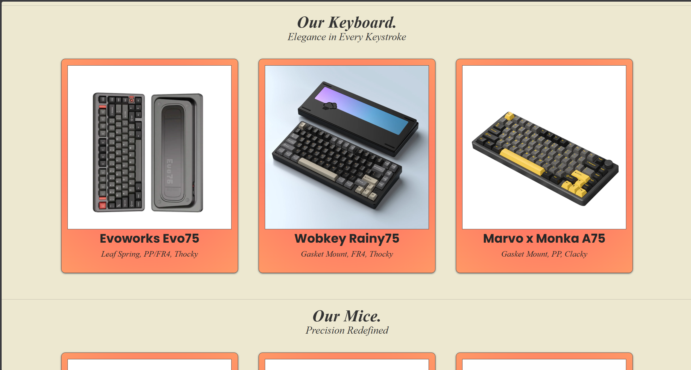
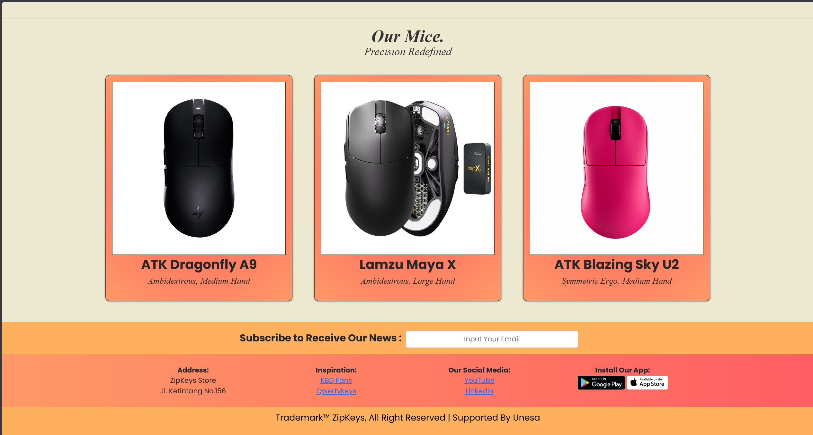
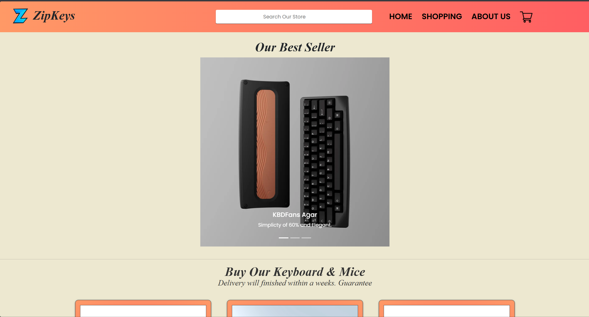

# ZipKeys
ZipKeys is a simple online marketplace website focused on selling computer peripherals, currently limited to mice and keyboards.
This project was created for Mid-Term (UTS) purposes and as practice for applying fundamental Front-End web development concepts.

## 📌 Project Description

In this project, I built a basic buying and selling website using a peripherals marketplace concept.
The main products featured are flagship keyboards and mice.

## ✨ Features

- Built with HTML, CSS, and JavaScript for basic functionality

- Interactive UI/UX
  
- Simple buying and selling system

Please excuse any limitations or simplicity, as this project is intended as a basic Front-End practice.
## 📄 Notes

Feel free to customize and modify this project for learning purposes.
> FOR PERSONAL USE ONLY

## Screenshots

